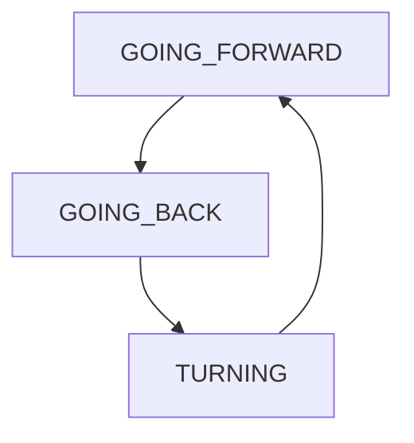
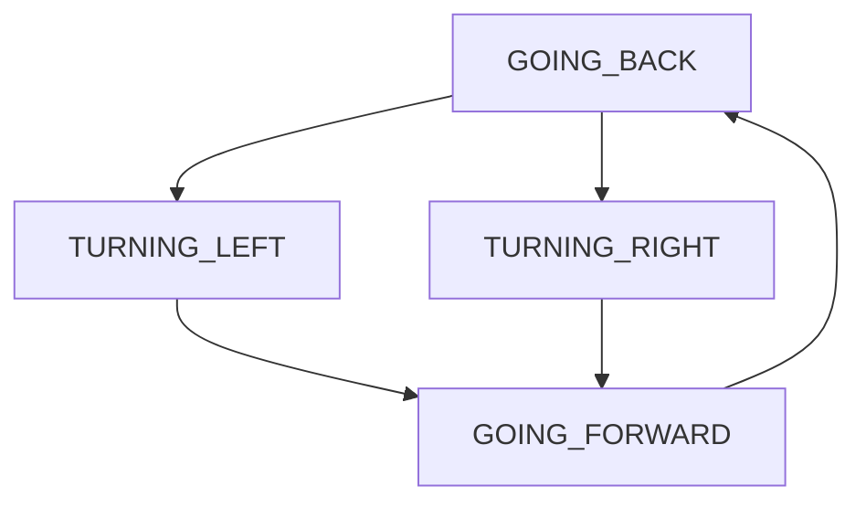

# bump-and-go-with-fsm-los-ultramarinos
## Índice
- [BumpGo_Basic](#BumpGo-Basic)
- [BumpGo_Advanced](#BumpGo-Advanced)
- [BumpGo_Laser](#BumpGo-Laser)

## BumpGo_Basic
En esta versión se nos ha pedido hacer un programa básico de bump and go en el cual avance hasta que salte el bumper, donde retrocedera y girará para esquivarlo.
### Maquina de Estados


### Funciones
| Funciones | Descripción |
| --- | --- |
| bumperCallback | Detecta si fue pulsado el bumper y cambia de estado |
| step | Publica la velocidad del robot en función del estado en el que esté |
### Launch
```
roslaunch fsm_bump_go bumpgo_Basic.launch
```

## BumpGo_Advanced
En esta versión se nos ha pedido hacer un programa bump and go que sepa por donde detecta un objeto cuando se choca con él usando su bumper.
### Maquina de Estados

### Funciones
| Funciones | Descripción |
| --- | --- |
| bumperCallback | Detecta si fue pulsado el bumper diferenciando laterales y cambia de estado |
| step | Publica la velocidad del robot en función del estado en el que esté y gira al contrario del golpe |

### Launch
```
roslaunch fsm_bump_go bumpgo_Advanced.launch
```

## BumpGo_Laser
En esta versión se nos ha pedido hacer un programa bump and go usando el láser.

### Funciones
| Funciones | Descripción |
| --- | --- |
| valorApto |  |
| hacerMedia |  |
| hayObstaculo |  |
| laserCallback |  |
| step |  |
### Launch
```
roslaunch fsm_bump_go bumpgo_Laser.launch
```

## Roslint
```
catkin_make roslint_fsm_bump_go
```
## Launch Simulador
```
roslaunch robots sim.launch
```
